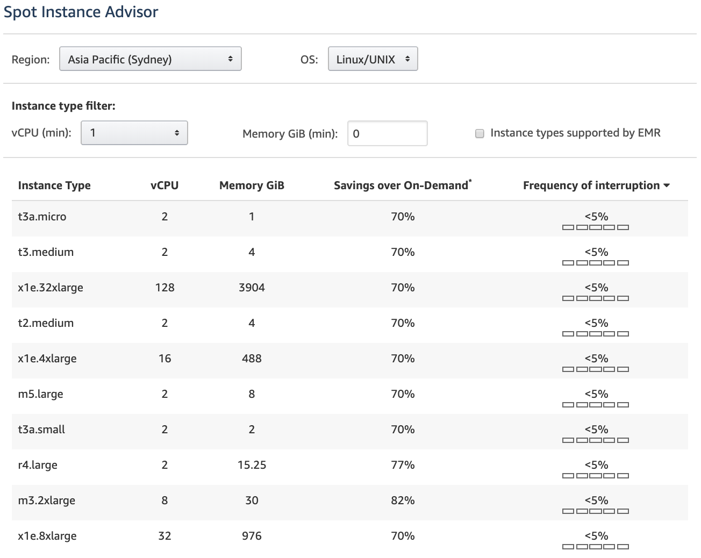

# How to save money running EKS Workers on Spot Instances

# Agenda

- [whois](#whois)
- [Introduction](#introduction)
    - [AWS AWS Amazon Elastic Container Service for Kubernetes (EKS)](#aws-amazon-elastic-container-service-for-kubernetes-(eks))
    - [AWS EC2 Purchase Options](#aws-ec2-purchase-options)
    - [AWS Spot Instances](#aws-spot-instances)
    - [AWS Spot Fleet](#aws-spot-fleet)
    - [AWS Auto Scaling Group](#aws-auto-scaling-group)
- [Use Cases](#use-cases)
- [Lab demo](#lab-demo)
    - [Spot Interrupt Handler](#spot-interrupt-handler)
    - [Cluster AutoScaler (CA)](#cluster-autoscaler-(ca))
    - [Horizontal Pod Autoscaler](#horizontal-pod-autoscaler)
- [Tips and Gotchas](#tips-and-gotchas)
- [Bonus CKA & CKAD Tips](#bonus-cka-&-ckad-tips)
- [References](#references)

# whois

*Caio Trevisan* - Cloud Engineer at Contino

[www.caiotrevisan.com](https://www.caiotrevisan.com)

# Introduction

## AWS Amazon Elastic Container Service for Kubernetes (EKS)


- Multi-AZ Kubernetes control plane deployment managed by AWS
- auto-healing
- ondemand patching and upgrades
- ~$150USD/monthly

- need workers -- pay separately

[AWS EKS Documentation](https://aws.amazon.com/eks/)

## AWS EC2 Purchase Options

- On-Demand: pay by the hour or second  
- Reserved Instances: up to 75% discount, one to three-year commitment
- Spot Instances: bid for spare EC2 capacity, up to 90% discount

[AWS EC2 Pricing Documentation](https://aws.amazon.com/ec2/pricing/)

## Spot Instances

- predictable pricing
- up to 90% of savings
- termination notice

Good use for:

- Flexible start/end times
- Applications that handle well failure
- Large computing needs for jobs like EMR or Data processing

[AWS EC2 Spot Instances Documentation](https://aws.amazon.com/ec2/spot/)

### Pricing History

Pricing of a `m5.large` instance from `Jul/19` to `Oct19` in region SydneyAU `ap-southeast-2`.

|Instance Type|Price|
|-|-|
|On-demand|0.12|
|Spot|0.0362|


### Spot Instance Advisor



[AWS Spot Instances Advisor](https://aws.amazon.com/ec2/spot/instance-advisor/)


## Spot Fleet

- collection/group/fleet of spot instances
- request is fulfilled either by reaching target capacity or exceeding the maximum price

### Spot Fleet Request

- one-time / maintain
- launch specifications: instance types / az (up to 50)
- target capacity
- on-demand portion
- defined price vs on-demand price

[AWS Spot Fleet Documentation](https://docs.aws.amazon.com/AWSEC2/latest/UserGuide/spot-fleet.html)

# Use cases

# Lab demo

## Spot Interrup Handler


## Cluster AutoScaler (CA)

`sed -i '' "s/<INSERT-YOUR-SPOT-INSTANCES-ASG-NAME-HERE>/test/g" "k8s-tools/cluster_autoscaler/cluster_autoscaler.yml"`

## Horizontal Pod Autoscaler

```bash
helm install stable/metrics-server \
    --name metrics-server \
    --version 2.0.2 \
    --namespace metrics

kubectl run php-apache --image=k8s.gcr.io/hpa-example --requests=cpu=200m --limits=cpu=500m --expose --port=80

kubectl expose deploy php-apache --target-port=80 --port=80 --type=LoadBalancer

kubectl autoscale deployment php-apache --cpu-percent=30 --min=1 --max=10
```

[Kubernetes HPA Documentation](https://kubernetes.io/docs/tasks/run-application/horizontal-pod-autoscale-walkthrough/)

### generate load

```bash
while true; do wget -q -O - http://www.apache.contino.caiotrevisan.com &&; done
```

### continuous service test

```bash
i=0
while true
do
http_status=`curl -s -o /dev/null -w "%{http_code}" www.apache.contino.caiotrevisan.com --connect-timeout 1`
echo request $i - $http_status
sleep 1
i=$((i + 1))
done
```

# Tips and Gotchas

- ebs volumes cannot span multple aws availability zone
- efs for multiaz support to permanent volumes

# Bonus CKA & CKAD tips

[Contino Ultimate Guide to Passing the CKA Exam](https://www.contino.io/insights/the-ultimate-guide-to-passing-the-cka-exam)

- best content around -- Linux Academy CKA course 
- bookmarks for Kubernetes documentation
- no need for auto-completion as the terminal comes pre-configured
- you can split view your browser with k8s documentation and the exam (only these two tabs open)
- book exam in the morning so you are 100% for a 3 hours exam
- basic set of aliases on `.bash_profile` first thing once the test start
```
alias k='kubectl'
alias kgp='k get po'
alias kgd='k get deploy'
alias kgs='k get svc'
alias kcc='k config current-context'
alias kuc='k config use-context'
alias ka='k apply'
alias kc='k create'
alias kd='k delete'
alias kg='k get'
```

# References

- Spot Instances termination notices:
https://aws.amazon.com/blogs/aws/new-ec2-spot-instance-termination-notices/

- Running EKS workloads on Spot Instances:
https://aws.amazon.com/blogs/compute/run-your-kubernetes-workloads-on-amazon-ec2-spot-instances-with-amazon-eks/

- AWS Spot Instances Pricing Advisor:
https://aws.amazon.com/ec2/spot/instance-advisor/

- Using Spot Instances for cost optimizations:
https://d1.awsstatic.com/whitepapers/cost-optimization-leveraging-ec2-spot-instances.pdf

- Purchase options types on ASG:
https://docs.aws.amazon.com/en_pv/autoscaling/ec2/userguide/asg-purchase-options.html#asg-allocation-strategies

- Using EKSCTL with existing iam and vpc:
https://eksctl.io/examples/reusing-iam-and-vpc/

- Spot Instances termination notice handler:
https://github.com/kube-aws/kube-spot-termination-notice-handler

- Overprovisioning with Cluster Autoscaler (CA):
https://github.com/kubernetes/autoscaler/blob/master/cluster-autoscaler/FAQ.md#how-can-i-configure-overprovisioning-with-cluster-autoscaler

- Gotchas when using Cluster Autoscaler (CA):
https://github.com/kubernetes/autoscaler/tree/master/cluster-autoscaler/cloudprovider/aws#common-notes-and-gotchas

- Re:Invent 2018 Spot Instances with EKS:
https://www.slideshare.net/AmazonWebServices/amazon-ec2-spot-with-amazon-eks-con406r1-aws-reinvent-2018

- AWS Getting Started with EKS:
https://aws.amazon.com/getting-started/projects/deploy-kubernetes-app-amazon-eks/

- AWS Quickstart EKS:
https://s3.amazonaws.com/aws-quickstart/quickstart-amazon-eks/doc/amazon-eks-architecture.pdf

- Kubernetes Docs:
https://kubernetes.io/docs/

- kubectl drain:
https://kubernetes.io/images/docs/kubectl_drain.svg

